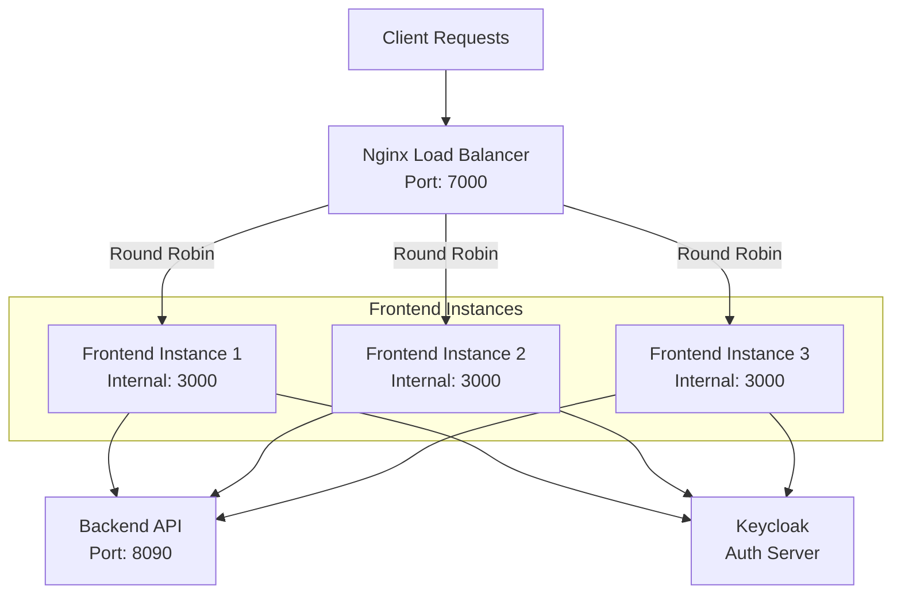

# Devlabs Frontend

Next.js frontend application for the Devlabs project management and evaluation system. Provides an intuitive interface for administrators, faculty, and students to collaborate on project-based learning.

## Tech Stack

- **Framework:** Next.js 16 with App Router
- **Language:** TypeScript
- **UI Library:** React 19
- **Styling:** Tailwind CSS
- **Components:** shadcn/ui + Radix UI
- **State Management:** React Query (TanStack Query)
- **Authentication:** NextAuth.js
- **HTTP Client:** Axios
- **Package Manager:** pnpm

## Prerequisites

- Node.js 18 or higher
- pnpm (recommended)
- Docker & Docker Compose (for containerized setup)

## Quick Start with Docker

### 1. Clone the repository

```bash
git clone https://github.com/TharunCodes07/devlabs-frontend.git
cd devlabs-frontend
```

### 2. Configure environment

Copy the example environment file and update with your values:

```bash
cp .env.example .env
```

Edit `.env` and update with your backend URL and Keycloak settings.

### 3. Run with Docker Compose

```bash
docker-compose up -d
```

The application will be available at `http://localhost:3000`

### 4. Stop services

```bash
docker-compose down
```

## Local Development Setup

### 1. Clone and install

```bash
git clone https://github.com/TharunCodes07/devlabs-frontend.git
cd devlabs-frontend
pnpm install
```

### 2. Configure environment

Copy `.env.example` to `.env` and configure:

```env
NODE_ENV=development
AUTH_SECRET=your_auth_secret_key
NEXT_REDIRECT=http://localhost:3000
LOG_LEVEL=info
AUTH_KEYCLOAK_ID=devlabs-client
AUTH_KEYCLOAK_SECRET=client_secret_123
AUTH_KEYCLOAK_ISSUER=http://localhost:8060/realms/devlabs
BACKEND_API_URL=http://localhost:8090
NEXT_PUBLIC_API_URL=http://localhost:8090
FRONTEND_PORT=3000
```

### 3. Run the development server

```bash
pnpm dev
```

Open `http://localhost:3000` in your browser.

## Available Scripts

| Command             | Description              |
| ------------------- | ------------------------ |
| `pnpm dev`          | Start development server |
| `pnpm build`        | Build for production     |
| `pnpm start`        | Start production server  |
| `pnpm lint`         | Run ESLint               |
| `pnpm lint:fix`     | Fix ESLint issues        |
| `pnpm format`       | Format with Prettier     |
| `pnpm format:check` | Check formatting         |

## Environment Variables

Key environment variables (see `.env.example` for complete list):

| Variable               | Description                                 | Default                 |
| ---------------------- | ------------------------------------------- | ----------------------- |
| `NODE_ENV`             | Environment mode                            | `development`           |
| `AUTH_SECRET`          | NextAuth secret key                         | -                       |
| `NEXT_REDIRECT`        | Redirect URL after auth                     | `http://localhost:3000` |
| `LOG_LEVEL`            | Logging level (trace/debug/info/warn/error) | `info`                  |
| `AUTH_KEYCLOAK_ID`     | Keycloak client ID                          | -                       |
| `AUTH_KEYCLOAK_SECRET` | Keycloak client secret                      | -                       |
| `AUTH_KEYCLOAK_ISSUER` | Keycloak issuer URL                         | -                       |
| `BACKEND_API_URL`      | Backend API URL (server-side)               | `http://localhost:8090` |
| `NEXT_PUBLIC_API_URL`  | Backend API URL (client-side)               | `http://localhost:8090` |
| `FRONTEND_PORT`        | Port to run on                              | `3000`                  |

## Features

### Academic Management

- Course and semester organization
- Student and faculty management
- Batch assignment and tracking

### Project & Team Management

- Project lifecycle management
- Team formation and collaboration
- File upload and document management
- Status tracking (Proposed, Ongoing, Completed, Rejected)

### Evaluation & Assessment

- Course evaluations with custom criteria
- Peer and instructor assessments
- Multi-stage review process
- Individual scoring with rubrics

### Analytics & Reporting

- Performance dashboards
- Progress tracking
- Data export capabilities
- Interactive charts and visualizations

### User Experience

- Responsive design for all devices
- Dark/Light mode
- Drag & drop interactions
- Real-time updates

## Production Deployment

### Single Instance (Simple Setup)

For single instance deployment without load balancing:

#### 1. Update environment

Set production values in `.env`:

```env
NODE_ENV=production
AUTH_SECRET=strong_random_secret_min_32_chars
NEXT_REDIRECT=https://your-domain.com
AUTH_KEYCLOAK_ISSUER=https://your-keycloak-domain.com/realms/devlabs
BACKEND_API_URL=https://your-backend-api.com
NEXT_PUBLIC_API_URL=https://your-backend-api.com
```

#### 2. Deploy with Docker Compose

```bash
docker-compose up -d
```

#### 3. Check logs

```bash
docker-compose logs -f frontend
```

### Multi-Instance with Load Balancing (High Availability)

For production environments requiring high availability and load balancing across multiple frontend instances:



#### Architecture Overview

- **Nginx Reverse Proxy:** Distributes incoming requests across 3 frontend instances using round-robin algorithm
- **Load Balancing:** Automatic failover if an instance becomes unhealthy (max 3 fails, 30s timeout)
- **Session Handling:** NextAuth handles sessions via JWT tokens, no sticky sessions needed
- **Health Checks:** Nginx monitors root endpoint for each frontend instance
- **Static Asset Caching:** Nginx caches `_next/static` assets for better performance
- **Scalability:** Add or remove instances by modifying `docker-compose.prod.yml`

#### 1. Configure Nginx

The `nginx.conf` file is already configured for load balancing. You can adjust the number of instances by modifying the upstream block:

```nginx
upstream frontend_servers {
    server frontend-1:3000 max_fails=3 fail_timeout=30s;
    server frontend-2:3000 max_fails=3 fail_timeout=30s;
    server frontend-3:3000 max_fails=3 fail_timeout=30s;
}
```

#### 2. Deploy with production compose file

```bash
docker-compose -f docker-compose.prod.yml up -d
```

This will start:

- 3 frontend instances (frontend-1, frontend-2, frontend-3)
- 1 Nginx load balancer (exposed on port 7000)

#### 3. Scale instances dynamically

To add more instances, edit `docker-compose.prod.yml` and add frontend-4, frontend-5, etc., then update `nginx.conf` and restart:

```bash
docker-compose -f docker-compose.prod.yml up -d
```

#### 4. Monitor health

Check which frontend instance is serving requests:

```bash
curl -I http://localhost:7000
```

Look for the `X-Upstream-Server` header to see which instance responded.

#### 5. View logs

All instances:

```bash
docker-compose -f docker-compose.prod.yml logs -f
```

Specific instance:

```bash
docker-compose -f docker-compose.prod.yml logs -f frontend-1
```

Nginx logs:

```bash
docker-compose -f docker-compose.prod.yml logs -f nginx
```

#### Benefits

- **High Availability:** If one instance fails, Nginx automatically routes to healthy instances
- **Load Distribution:** Requests distributed evenly using round-robin
- **Better Performance:** Static assets cached by Nginx
- **Zero Downtime Deployments:** Rolling updates possible by restarting instances one at a time
- **Horizontal Scaling:** Easy to add more instances as traffic grows
- **WebSocket Support:** Properly configured for Next.js live reload and real-time features

## Project Structure

```
devlabs-frontend/
├── src/
│   ├── app/                    # Next.js app router pages
│   │   ├── (auth)/            # Authentication pages
│   │   ├── (devlabs)/         # Main app pages
│   │   └── api/               # API routes
│   ├── components/            # React components
│   │   ├── admin/
│   │   ├── dashboard/
│   │   ├── evaluations/
│   │   ├── projects/
│   │   ├── teams/
│   │   └── ui/                # shadcn/ui components
│   ├── hooks/                 # Custom React hooks
│   ├── lib/                   # Utilities and configs
│   │   ├── axios/             # API client
│   │   ├── auth.ts            # Auth config
│   │   ├── logger.ts          # Pino logger
│   │   └── utils.ts           # Helper functions
│   ├── repo/                  # API query functions
│   └── types/                 # TypeScript types
├── public/                    # Static assets
├── docker-compose.yml
├── Dockerfile
├── next.config.ts
├── tailwind.config.ts
└── package.json
```

## Logging

The application uses Pino for structured logging. Control log verbosity with `LOG_LEVEL`:

- `trace` - Most verbose
- `debug` - Debug information
- `info` - General information (default)
- `warn` - Warnings
- `error` - Errors only
- `fatal` - Critical errors

Usage:

```typescript
import { logger } from "@/lib/logger";

logger.info("User logged in", { userId: "123" });
logger.error("API call failed", { error, endpoint: "/api/users" });
```

## Troubleshooting

### Application won't start

Check logs:

```bash
docker-compose logs frontend
```

### Authentication issues

Verify Keycloak configuration in `.env`:

- Correct realm name
- Valid client ID and secret
- Accessible issuer URL

### Backend connection issues

Ensure:

- Backend is running and accessible
- CORS is configured on backend
- `BACKEND_API_URL` and `NEXT_PUBLIC_API_URL` are correct

## 🌟 Key Features Breakdown

### Course Management

- Create and manage academic courses
- Assign instructors and students
- Organize courses within semesters
- Track course-specific performance metrics

### Project Lifecycle

- Project proposal and approval workflow
- Team assignment and collaboration tools
- File upload and version management
- Multi-stage review and evaluation process

### Evaluation System

- Customizable evaluation criteria
- Peer and instructor assessments
- Real-time scoring and feedback
- Comprehensive rubric management

### Analytics Dashboard

- Performance tracking across courses and projects
- Visual representations of progress and achievements
- Export capabilities for detailed reporting
- Trend analysis and insights

## Contributing

We welcome contributions! Whether it's fixing a bug, improving documentation, or suggesting new features.

### How to Contribute

1. Fork the repository
2. Create a feature branch (`git checkout -b feature/amazing-feature`)
3. Commit your changes (`git commit -m 'Add amazing feature'`)
4. Push to the branch (`git push origin feature/amazing-feature`)
5. Open a Pull Request

### Development Guidelines

- Follow TypeScript best practices
- Use existing components from shadcn/ui
- Write meaningful commit messages
- Test your changes thoroughly
- Update documentation as needed

## License

This project is part of the Devlabs ecosystem.

Built with ❤️ by the Devlabs team.
